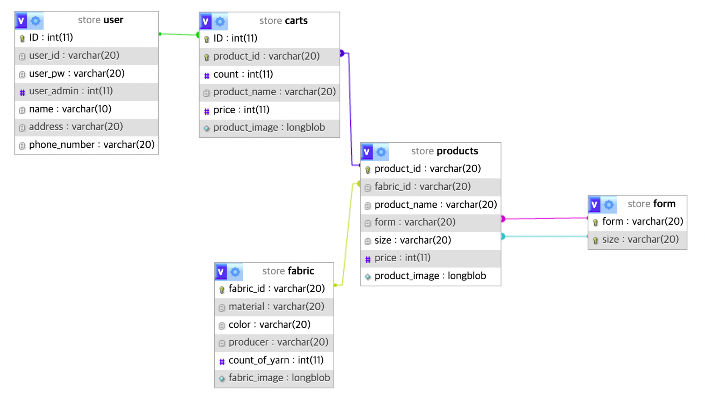

- WEB

- DB

## PHP

- With the server-side scripting language, you can create dynamic web pages.
- It can be connected to various databases to store and query data.

## MySQL

- A relational database management system that efficiently stores and manages data.
- Use Structured Query Language (SQL) to help retrieve, insert, update, and delete data.
- Maintain data integrity and ensure data consistency through transactions.

## Node.js

- You can build high-performance network applications using event-based, asynchronous I/O models.
- Simplify overall stack development by making JavaScript available on the server side as well.
- Node Package Manager (NPM) makes it easy to manage and use a variety of packages and libraries.
