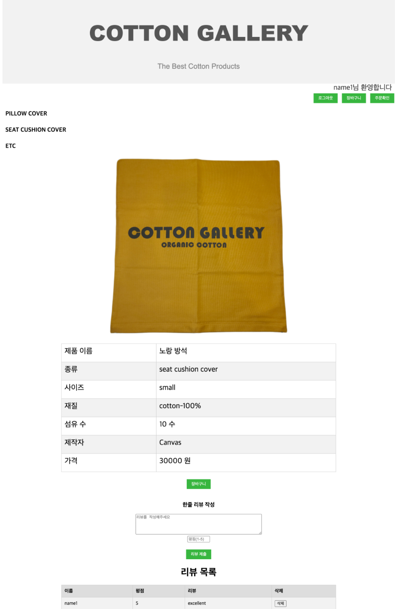
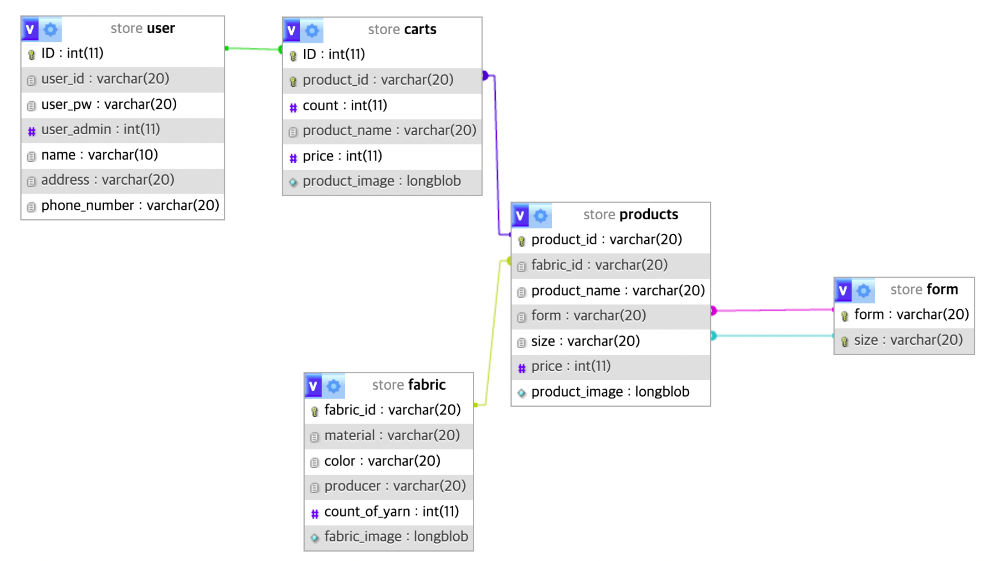

- 쇼핑몰 사진

- DB 사진

## PHP

- 서버 사이드 스크립팅 언어로, 동적인 웹 페이지를 생성할 수 있습니다.
- 다양한 데이터베이스와 연결하여 데이터 저장 및 조회가 가능합니다.

## MySQL

- 관계형 데이터베이스 관리 시스템으로, 데이터의 저장과 관리를 효율적으로 수행합니다.
- SQL(Structured Query Language)을 사용하여 데이터 검색, 삽입, 업데이트 및 삭제를 지원합니다.
- 데이터의 무결성을 유지하고, 트랜잭션을 통해 데이터 일관성을 보장합니다.

## Node.js

- 이벤트 기반, 비동기 I/O 모델을 사용하여 높은 성능의 네트워크 애플리케이션을 구축할 수 있습니다.
- JavaScript를 서버 측에서도 사용할 수 있게 하여 전체 스택 개발을 간소화합니다.
- NPM(Node Package Manager)을 통해 다양한 패키지와 라이브러리를 쉽게 관리하고 사용할 수 있습니다.
